# DTSGUI tutorial

## 1. Start DTSGUI

Start DTSGUI by double clicking on the executable. The program may take take a
bit to load.

## 2. Load the data for channel 1

The first dialog you will see is shown below. Choose the Sensornet item, as
shown. A system dialog prompting you for a folder will appear. From the top
level directory of this repository, the Sensornet data you will load is located
in `test\data\quashnet\channel1`. Navigate to the directory in the dialog and
open the folder.

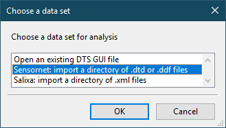

A dialog prompting you for a data set name will appear (shown below). Name the
data set Channel1, as shown. Click the OK button.

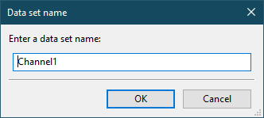

The program will load the data in the directory. Once the process is complete,
the main DTSGUI window will appear, with an editor tab for Channel1
(shown below). This tab gives you access to all of the editing and viewing
features for Channel1.

## 3. View the channel data

The first thing you'll do after loading the data is view the temperature time
series from channel 1. Click on View Channel Data in the channel 1 editor
within the main DTSGUI window. A viewer tab for the channel 1 data will appear
in the main window as shown below.

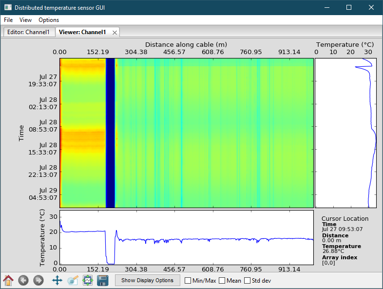

The viewer automatically sets the bounds of the colormap based on the
minimum and maximum temperatures in the time series. The portion of the cable
that was in the ice bath is included in this time series. The temperatures
in the ice bath affect the automatically selected bounds of the colormap. You
could either adjust the lower bound of the colormap or trim the raw data of the
time series to exclude the ice bath portion.

Next you'll trim the raw data and remove the portion of the cable that was
submerged in the ice bath from the time series.

## 4. Trim the raw data

Click on the Trim Raw Data button within the editor tab for channel 1 (see
below).

After clicking on the button, a tab called Trim Raw Data will appear. The
main window will look similar to the figure below.

Change the minimum distance range by selecting the Min text box. The value in
the box will change from 0.0 m (distance) to 0 (an integer indicating the
index of the distance array). To change the minimum distance in the range to
the value shown in the figure below, type 223 (the index that corresponds to
the distance of 226.2558 m in the distance array).

Click the Trim Raw Data button. The Trim Raw Data tab will close and you will
be returned to the editor tab.

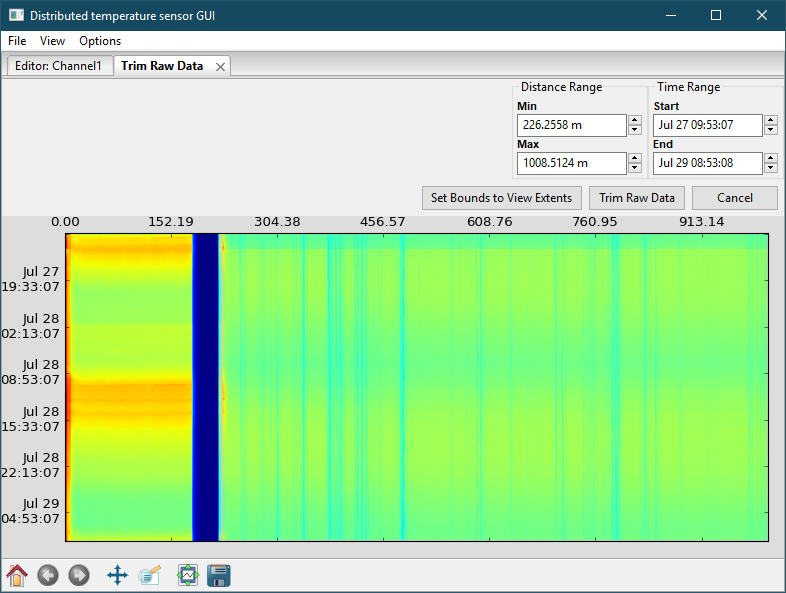

Within the editor tab for channel 1, click the View Channel Data button again.
The program will automatically update the limits of the colormap based on the
trimmed data set (as shown below).

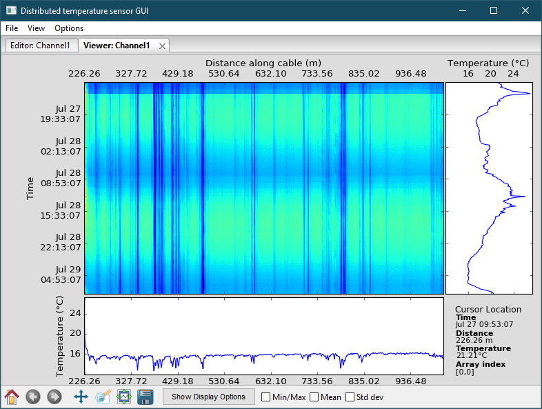

## 5. Show the colorbar

To show the colorbar that corresponds to the colormap in the temperature data
viewer, click the Show Display Options button at the bottom of the viewer tab.
After clicking the button, display options will be shown.

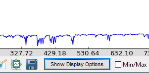

Click the Colorbar box. After clicking the box, the main window will look like
the below figure.

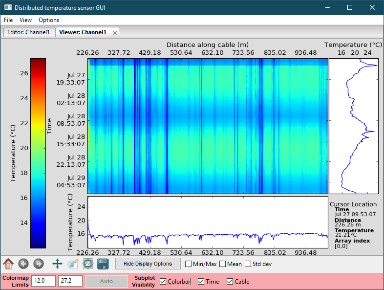

Within the display options, you can also set the colormap limits and hide or
show the time and cable plots.

Click the Hide Display Options button to hide the display options.

## 6. Import geospatial data

In order to view the temperature data on a map, you must associate the cable
coordinates to geospatial coordinates. You accomplish this by using a feature
of DTSGUI to import geospatial data.

To import geospatial data, click on the Import Geospatial Data button within
the editor tab for channel 1. The button is highlighted below.

After clicking the button, a dialog prompting you for the location of the file
containing cable reference data. From the top-level directory of this
repository, the file is `test\data\quashnet\channel 1_X_Y_UTM.txt`. In the
dialog, navigate to the file and open it. This will begin the import process.

After the program reads the file, a tab named Import Geodata will appear in the
main window. The tab will look similar to the tab shown in the figure below.

The default coordinate system selected is latitude/longitude, but the
geo-reference data in the file are in UTM coordinates. Specifically, the first
column is easting and the second column is northing. Click the column headers
in the Import Geodata tab and change the first column to Easting and the
second to Northing. Set the UTM zone to 15 in the Set UTM Zone text box below
the Data Preview section of the tab. The import tab should look like the tab
in the figure below.

Click the OK button. The Import Geodata tab will close.

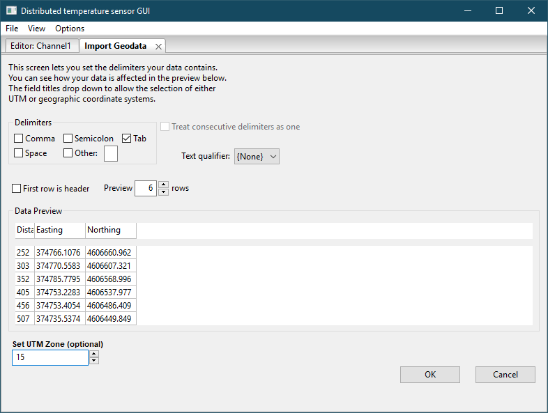

The program will finish importing the geospatial data and associate the cable
distances with geospatial coordinates. When this is complete, the map viewer
buttons in the channel 1 editor tab will be enabled. See the below figure.

## 7. View the channel data on Google Maps

To view the georeferenced temperature data, click the Google Maps Viewer
button in the channel 1 editor tab. A new tab named Google Maps: Channel 1 will
appear in the main window (as shown in the figure below).

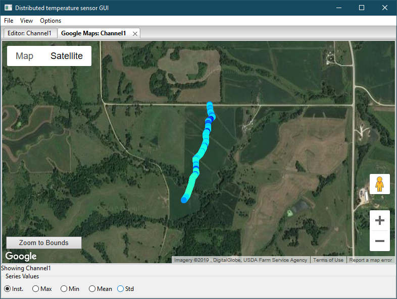

There are options to view the "instantaneous," maximum, and minimum
temperatures at a point through time, or the standard deviation of the
temperature through time. To change the time of the instantaneous temperatures,
open a viewer tab and, within the colormap, click on the time you want to see.
Go back to the map viewer tab and you'll see the instantaneous temperature
for that time.

## 8. Export the channel data as a CSV

To export a subset (either a complete channel data time series or a user-
created subset), click on the Subset as CSV button in the channel 1 editor tab,
shown in the below figure. A dialog prompting you for a location to save the
CSV file will appear. After you choose a file location, the program will create
a CSV file containing the temperature time series with geospatial coordinates
(if the data have been georeferenced).

You can also export a CSV file containing georeferenced temperature statistics
through time using the Subset stats as CSV button.

## 9. Import channel 2 data

An instance of DTSGUI can contain data for multiple channels. The import
process is similar to the import process you experienced when you first started
the program.

To import channel 2 of the example Sensornet data set, click on the Import data
item under the File menu (see below). In the dialog that appears, navigate to
the directory containing the channel 2 data. The channel 2 data is in the
`channel2` directory on the same level as the channel 1 data. Name this data
set Channel2.

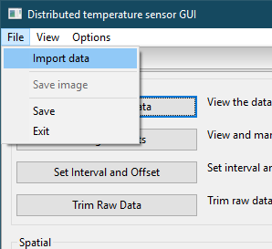

After importing the channel 2 data, an editor tab for channel 2 will appear.

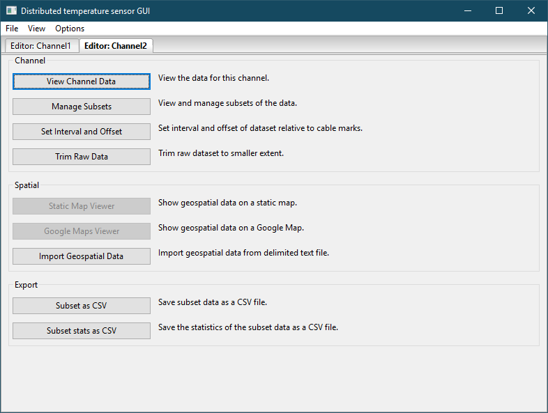

Use the instructions in step 4 as a guide to trim the raw data for channel 2.
Enter 312 as the value for the minimum distance index.

Click the button in the channel 2 editor to import geospatial data for channel
2. The process is similar to the steps you took to import geospatial data
for channel 1 in step 6. The geospatial reference points for channel 2
are in a `channel 2_X_Y_UTM.txt`. Be sure to change the coordinates to Easting
and Northing and specify UTM zone 15.
